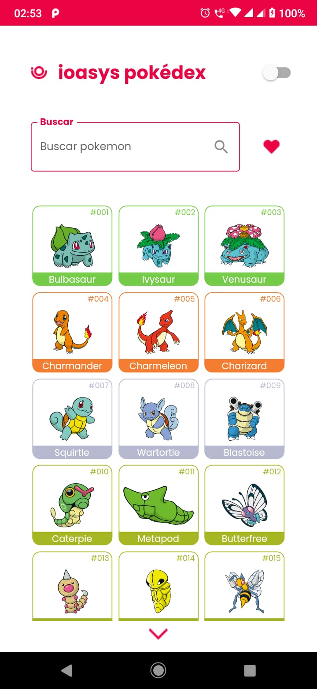
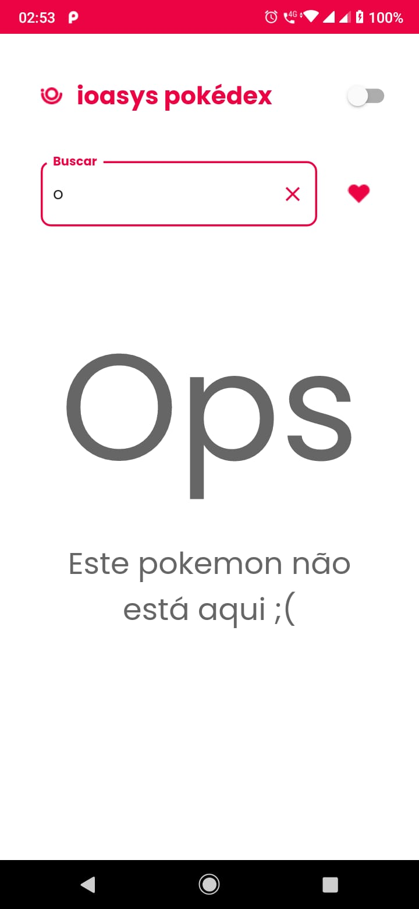
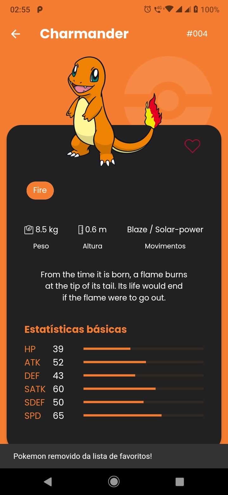

App flutter 'Pokemon' Desafio do ioasys Camp 4ª edição 2022

##

Telas do app:

1. Na primeira tela foi feita uma requisição para obter uma lista de pokemons. Também é possível fazer uma pesquisa por nome de pokemon (é realizada outra requisição); 
   
2. Tela de detalhes de um pokemon:  são mostrados os detalhes do pokemon clicado na tela anterior; 
   
3. Tela de pokemons favoritos: é mostrada a lista de pokemons favoritados pelo usuário na tela de detalhes.

##

Principais bibliotecas utilizadas:
- Para requisições api REST: Dio
- Banco local: Hive
- Injeção de dependência: Flutter Modular
- Gerenciamento de estado: MobX
- Testes unitários: Mockito

##

       